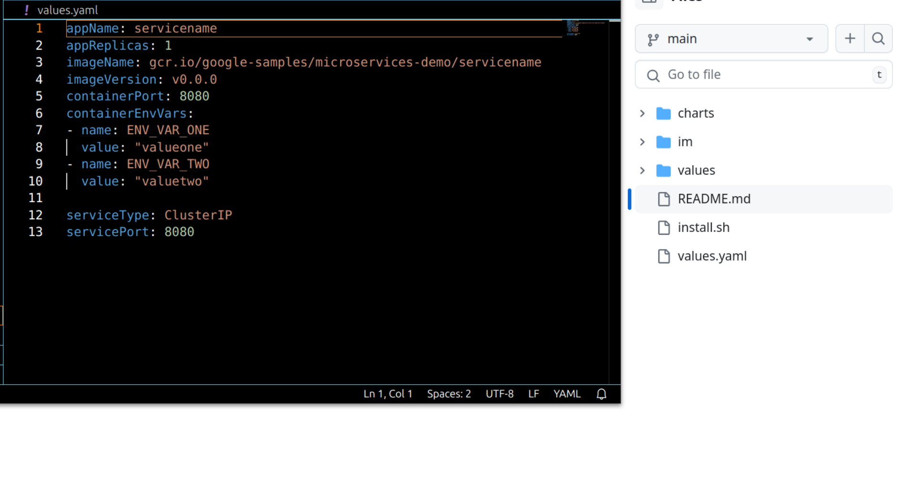
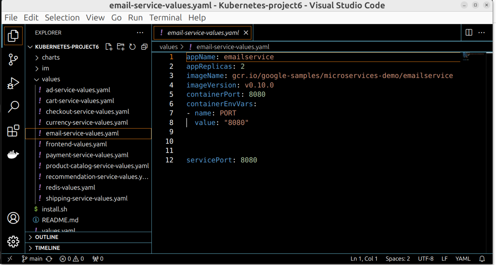
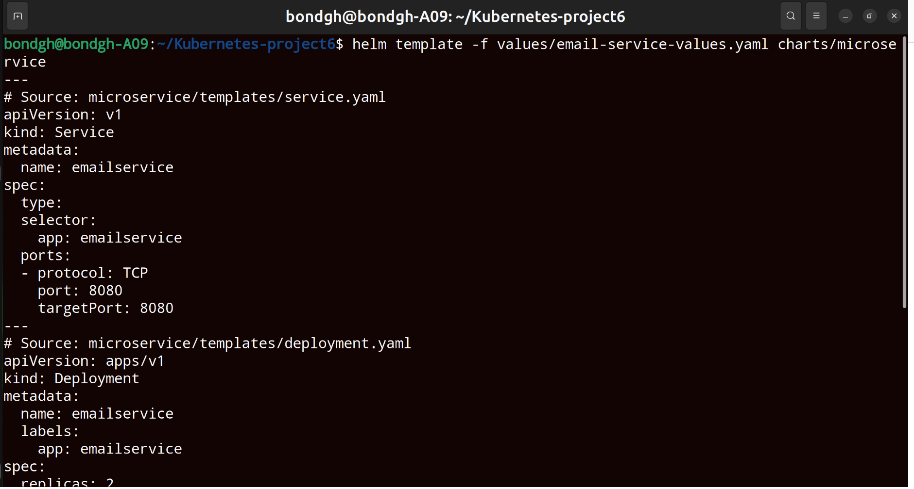
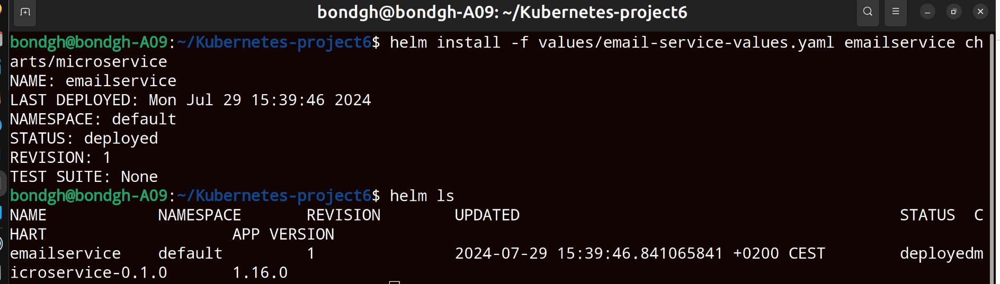
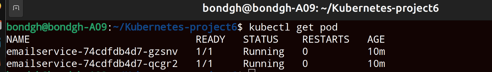
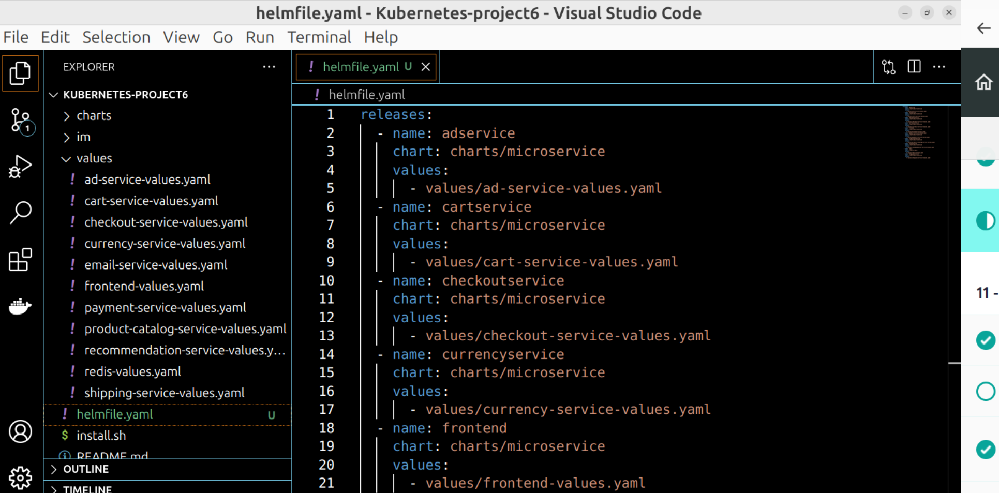

<h1>Kubernetes Demo Project6</h1>
<h2>Technologies used</h2>

- <b>Kubernetes</b> 
- <b>Helm</b>
- <b>Helmfile</b>

<h2>Detailed Description of Project </h2>
1. Create 1 shared Helm Chart for all microservices to reuse common deployment and Service configuratons for the services 
2. Deploy microservice with helm 
3. Deploy microservice with helmfile 

   

   <h2>step1</h2>
   Create a Helm chart with chart name "microservice" 
   "helm create microservice"
   Create "deployment.yaml" and "service.yaml" configuration files in the template repository 
   Create "values.yaml" file and define all the default values for the configuration files 
   

   Create values configuration files for each of the services to overide the default values 
   
   
 
  
   (helm template -f filename chartName) validates your configuration file  
   

   <h2>step2</h2>
   Install your chart using helm install command 
   helm install -f fileName releaseName chartName
   

   check if the pod installed is running in our cluster with "kubectl get pod" command 
   the 'emailservice' which was installed using helm install command is up and running 
   
   

   
   
  
  
  

   <h2>step3</h2>
 
   Deploy microservices with helmfile
   

   install helmfile tool using the command
   helm sync
   

 <h2>step4</h2>
 All pod are running and application can be accessed in the browser using the node IP and  
 configured external service IP with the frontend service 
 
     

